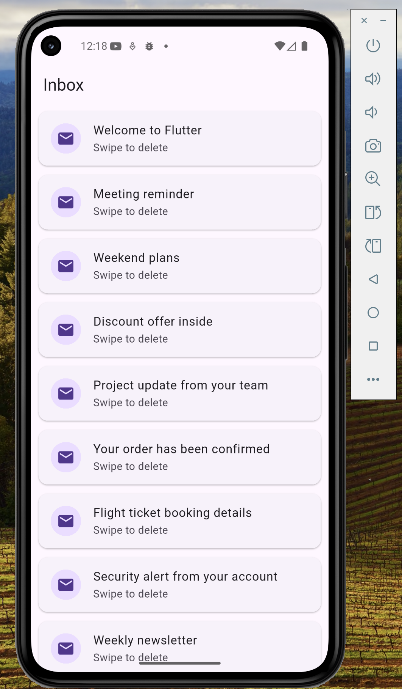

# Flutter Dismissible Widget Demo

A simple Flutter application demonstrating the **Dismissible widget**, which allows users to remove items from a list by swiping them horizontally.

---

## Widget Description

The **Dismissible widget** enables swipe gestures that remove items from the UI.  
It is commonly used in applications like email or task apps where users can **swipe items to delete or archive them**.

---

## Demo Features

- Scrollable inbox-style email list
- Swipe left or right to delete an email
- Visual delete background indicator
- SnackBar confirmation message after deletion
- Smooth UI updates using `setState()`

---

## Key Widget Attributes Explained

### 1. `key`
```dart
key: Key(email)
```

The **key** uniquely identifies each item in the list.  
Flutter uses this identifier to correctly track which widget is being removed when the swipe gesture occurs.

---

### 2. `background`
```dart
background: Container(
  color: Colors.red,
  child: Icon(Icons.delete),
)
```

The **background** defines what appears behind the list item while the user swipes it.  
In this demo, a **red delete indicator with a trash icon** appears, signaling that the item will be removed.

---

### 3. `onDismissed`
```dart
onDismissed: (direction) {
  setState(() {
    emails.removeAt(index);
  });
}
```

The **onDismissed** callback runs when the swipe gesture is completed.  
It removes the selected item from the list and triggers `setState()` to rebuild the UI.

---

## How to Run the Project

### 1. Clone the Repository

```bash
git clone https://github.com/your-username/dismissible_widget/widget_presentation.git
```

### 2. Navigate to the Project Folder

```bash
cd dismissible_widget/widget_presentation
```

### 3. Install Dependencies

```bash
flutter pub get
```

### 4. Run the Application

```bash
flutter run
```

Make sure a **Flutter emulator or physical device** is connected.

---

## Project Structure

```
widget_presentation/
│
├── README.md
├── screenshot.png
│
├── lib/
│   └── main.dart
│
├── pubspec.yaml
```

The entire demo logic is contained in `main.dart` for simplicity.

---

## Screenshot of Final UI

Below is an example of the final interface showing the inbox-style list.



---

## Technologies Used

- Flutter
- Dart
- Material Design Widgets

---

## Author

**Francis Mutabazi, March 2026**